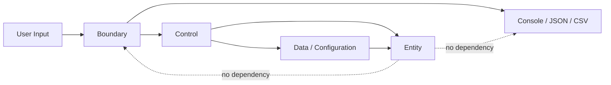

# Unit Converter Java

Java/클린 아키텍처 학습자가 `meter`, `feet`, `yard` 단위 변환 요구를 입력 검증, 비율 계약, 도메인 분리, 회귀 테스트 기준으로 학습할 수 있도록 지원하는 학습용 단위 변환 프로젝트입니다.

## 목차

- [개요 Overview](#개요-overview)
- [빠른 시작 Quick Start](#빠른-시작-quick-start)
- [지원 단위 및 비율](#지원-단위-및-비율)
- [입력 형식 계약](#입력-형식-계약)
- [아키텍처](#아키텍처)
- [테스트 실행](#테스트-실행)
- [설정 파일 JSON/YAML](#설정-파일-jsonyaml)
- [출력 포맷](#출력-포맷)
- [기여 가이드 Contributing](#기여-가이드-contributing)
- [라이선스](#라이선스)

## 개요 Overview

이 프로젝트는 단위 변환 계산식보다 먼저 흔들리기 쉬운 `unit:value` 입력 계약, 오류 처리, 출력 표현, 확장 요구를 테스트 가능한 기준으로 고정하는 문제를 해결합니다.

주요 학습 목표는 다음과 같습니다.

- OCP: 새 단위 또는 출력 포맷을 추가해도 기존 `meter`, `feet`, `yard` 변환 계약을 변경하지 않습니다.
- SRP: 입력 검증, 변환 규칙, 단위 등록, 설정 로드, 출력 표현 책임을 분리합니다.
- BCE: Boundary, Control, Entity의 책임과 의존성 방향을 구분합니다.
- TDD: README 비율, 오류 입력, 미지원 단위, 설정 오류, 원 입력 보존을 회귀 테스트로 보호합니다.

PRD 연결: 이 README는 Phase 5 PRD의 제품 계약을 사용자 문서로 요약한 문서입니다. 상세 요구사항은 [`docs/PRD.md`](docs/PRD.md)를 참조하세요.

## 빠른 시작 Quick Start

### 사전 조건

| 항목 | 요구사항 |
|---|---|
| Java | Java 17 |
| 빌드 도구 | Gradle 또는 Maven |
| 테스트 프레임워크 | JUnit 5 |

### 빌드 & 실행 명령

Gradle 사용 시:

```shell
./gradlew build
./gradlew run --args="meter:5.0"
```

Maven 사용 시:

```shell
mvn test
mvn exec:java -Dexec.args="meter:5.0"
```

### 예시 입출력

입력:

```text
meter:5.0
```

출력:

```text
5.0 meter = 16.4 feet
5.0 meter = 5.5 yard
```

## 지원 단위 및 비율

| 단위명 | 식별자 | meter 기준 비율 | 출처 |
|---|---|---|---|
| Meter | `meter` | `1 meter = 1 meter` | PRD 5.1 |
| Feet | `feet` | `1 feet = 1 / 3.28084 meter` | README / PRD 5.1 |
| Yard | `yard` | `1 yard = 1 / 1.09361 meter` | README / PRD 5.1 |

README 고정 비율은 `1 meter = 3.28084 feet`, `1 meter = 1.09361 yard`입니다. `feet`와 `yard` 사이의 변환은 직접 비율이 아니라 meter 허브 기준으로 계산합니다.

## 입력 형식 계약

입력은 정확히 `단위:값` 형식이어야 하며, 단위명과 값은 trim 후 비어 있으면 안 됩니다. 값은 십진수로 파싱 가능해야 하고, 0 미만 값은 거부됩니다.

정상 입력 예시:

```text
meter:5.0
feet:3.28084
yard:1.09361
```

비정상 입력 예시:

| 입력 | 오류 케이스 | 에러 메시지 패턴 |
|---|---|---|
| `meter=5.0` | 콜론 구분자 누락 | `ERROR:INVALID_FORMAT:*` |
| `meter:2.5.1` | 숫자 파싱 실패 | `ERROR:INVALID_NUMBER:*` |
| `meter:-1` | 음수 입력 | `ERROR:NEGATIVE_VALUE:*` |

미지원 단위 예시인 `mile:1`은 동적 등록 전까지 `ERROR:UNSUPPORTED_UNIT:*` 패턴으로 거부되어야 합니다.

## 아키텍처



의존성 방향:

| 레이어 | 책임 | 의존성 규칙 |
|---|---|---|
| Boundary | 외부 입력 검증, 출력 표현 | Control을 호출할 수 있습니다. |
| Control | 변환 흐름 조정, 오류 분류 | Entity 규칙과 Data 설정을 사용할 수 있습니다. |
| Entity | 단위, 비율, 변환 규칙 | Boundary 출력 형식에 의존하지 않습니다. |
| Data | 설정 로드, 동적 등록 데이터 | Entity가 이해할 수 있는 단위·비율 계약을 제공합니다. |

### 새 단위 추가 방법

1. 새 단위 식별자를 정합니다. 예: `cubit`
2. `1 unit = n meter` 의미의 meter 기준 비율을 정의합니다. 예: `1 cubit = 0.4572 meter`
3. 기존 `meter`, `feet`, `yard` 비율을 변경하지 않습니다.
4. 새 단위가 변환 입력 단위와 출력 대상 단위에 포함되는지 확인합니다.
5. README 기본 비율, 미지원 단위, 원 입력 보존 회귀 테스트가 계속 통과하는지 확인합니다.

## 테스트 실행

테스트 프레임워크: JUnit 5

Gradle:

```shell
./gradlew test
```

Maven:

```shell
mvn test
```

커버리지 목표:

| 영역 | 대상 | 목표 |
|---|---|---|
| Domain | 단위 비율, meter 허브 변환, 입력 단위 제외 규칙 | 라인 커버리지 85% 이상, 비율 계약별 테스트 1개 이상 |
| Boundary | 입력 문자열 검증, 출력 포맷 계약, 오류 메시지 분류 | 분기 커버리지 90% 이상 |
| Data | 설정 로드, 비율 값 검증, 동적 등록 계약 | 라인 커버리지 80% 이상, 설정 실패 유형별 테스트 1개 이상 |
| Regression | README 비율, 음수 정책, 소수 파싱 실패, 미지원 단위, 원 입력 보존 | 각 항목별 계약 테스트 1개 이상 |

## 설정 파일 JSON/YAML

설정 파일은 단위명과 `metersPerUnit` 값을 포함해야 합니다. `metersPerUnit`은 `1 unit = n meter` 의미를 가집니다.

권장 위치:

```text
config/units.json
config/units.yaml
```

JSON 예시:

```json
{
  "units": [
    { "unit": "meter", "metersPerUnit": 1.0 },
    { "unit": "feet", "metersPerUnit": 0.3047999902464003 },
    { "unit": "yard", "metersPerUnit": 0.9144027578387176 }
  ]
}
```

YAML 예시:

```yaml
units:
  - unit: meter
    metersPerUnit: 1.0
  - unit: feet
    metersPerUnit: 0.3047999902464003
  - unit: yard
    metersPerUnit: 0.9144027578387176
```

동적 단위 등록 예시:

```text
register:cubit:0.4572
```

계약 의미:

```text
1 cubit = 0.4572 meter
```

형식 오류, 필수 단위명 누락, 필수 비율 누락, 숫자가 아닌 비율, 0 이하 비율은 설정 로드 실패로 분류되어야 합니다.

## 출력 포맷

### 콘솔

```text
5.0 meter = 16.4 feet
5.0 meter = 5.5 yard
```

### JSON

```json
{
  "input": {
    "value": "5.0",
    "unit": "meter"
  },
  "results": [
    {
      "unit": "feet",
      "value": 16.4042,
      "displayValue": "16.4"
    },
    {
      "unit": "yard",
      "value": 5.46805,
      "displayValue": "5.5"
    }
  ],
  "error": null
}
```

### CSV

```csv
input_value,input_unit,target_unit,converted_value,display_value
5.0,meter,feet,16.4042,16.4
5.0,meter,yard,5.46805,5.5
```

## 기여 가이드 Contributing

- 계약 변경 금지: README 기본 비율 `1 meter = 3.28084 feet`, `1 meter = 1.09361 yard`, meter 허브 교차 변환, 음수 입력 거부, 원 입력 보존 계약은 PRD 변경 없이 수정하지 않습니다.
- 테스트 없는 PR 거부: 기능 추가, 결함 수정, 문서 계약 변경 PR은 관련 JUnit 5 테스트 또는 계약 검증 근거를 포함해야 합니다.
- 회귀 우선: 결함 수정 PR은 결함을 재현하는 실패 테스트를 먼저 정의해야 합니다.
- 커밋 메시지 컨벤션: `type: summary` 형식을 사용합니다.
- 허용 type: `docs`, `test`, `fix`, `feat`, `refactor`

커밋 메시지 예시:

```text
docs: document Phase 5 README contract
test: add regression tests for meter ratios
fix: reject negative unit values
```

## 라이선스

MIT License. 학습용 프로젝트로 사용합니다.
