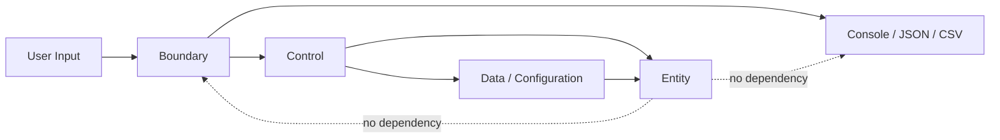

# Unit Converter Java

Java/클린 아키텍처 학습자가 `meter`, `feet`, `yard` 단위 변환 요구를 입력 검증, 비율 계약, 도메인 분리, 회귀 테스트 기준으로 학습할 수 있도록 지원하는 학습용 단위 변환 프로젝트입니다.

## 목차

- [개요 Overview](#개요-overview)
- [빠른 시작 Quick Start](#빠른-시작-quick-start)
- [지원 단위 및 비율](#지원-단위-및-비율)
- [입력 형식 계약](#입력-형식-계약)
- [아키텍처](#아키텍처)
- [테스트 실행](#테스트-실행)
- [설정 파일 JSON/YAML](#설정-파일-jsonyaml)
- [출력 포맷](#출력-포맷)
- [기여 가이드 Contributing](#기여-가이드-contributing)
- [To-Do 리스트 UnitConverter Java](#to-do-리스트-unitconverter-java)
- [라이선스](#라이선스)

## 개요 Overview

이 프로젝트는 단위 변환 계산식보다 먼저 흔들리기 쉬운 `unit:value` 입력 계약, 오류 처리, 출력 표현, 확장 요구를 테스트 가능한 기준으로 고정하는 문제를 해결합니다.

주요 학습 목표는 다음과 같습니다.

- OCP: 새 단위 또는 출력 포맷을 추가해도 기존 `meter`, `feet`, `yard` 변환 계약을 변경하지 않습니다.
- SRP: 입력 검증, 변환 규칙, 단위 등록, 설정 로드, 출력 표현 책임을 분리합니다.
- BCE: Boundary, Control, Entity의 책임과 의존성 방향을 구분합니다.
- TDD: README 비율, 오류 입력, 미지원 단위, 설정 오류, 원 입력 보존을 회귀 테스트로 보호합니다.

PRD 연결: 이 README는 Phase 5 PRD의 제품 계약을 사용자 문서로 요약한 문서입니다. 상세 요구사항은 [`docs/PRD.md`](PRD.md)를 참조하세요.

## 빠른 시작 Quick Start

### 사전 조건

| 항목 | 요구사항 |
|---|---|
| Java | Java 17 |
| 빌드 도구 | Gradle 또는 Maven |
| 테스트 프레임워크 | JUnit 5 |

### 빌드 & 실행 명령

Gradle 사용 시:

```shell
./gradlew build
./gradlew run --args="meter:5.0"
```

Maven 사용 시:

```shell
mvn test
mvn exec:java -Dexec.args="meter:5.0"
```

### 예시 입출력

입력:

```text
meter:5.0
```

출력:

```text
5.0 meter = 16.4 feet
5.0 meter = 5.5 yard
```

## 지원 단위 및 비율

| 단위명 | 식별자 | meter 기준 비율 | 출처 |
|---|---|---|---|
| Meter | `meter` | `1 meter = 1 meter` | PRD 5.1 |
| Feet | `feet` | `1 feet = 1 / 3.28084 meter` | README / PRD 5.1 |
| Yard | `yard` | `1 yard = 1 / 1.09361 meter` | README / PRD 5.1 |

README 고정 비율은 `1 meter = 3.28084 feet`, `1 meter = 1.09361 yard`입니다. `feet`와 `yard` 사이의 변환은 직접 비율이 아니라 meter 허브 기준으로 계산합니다.

## 입력 형식 계약

입력은 정확히 `단위:값` 형식이어야 하며, 단위명과 값은 trim 후 비어 있으면 안 됩니다. 값은 십진수로 파싱 가능해야 하고, 0 미만 값은 거부됩니다.

정상 입력 예시:

```text
meter:5.0
feet:3.28084
yard:1.09361
```

비정상 입력 예시:

| 입력 | 오류 케이스 | 에러 메시지 패턴 |
|---|---|---|
| `meter=5.0` | 콜론 구분자 누락 | `ERROR:INVALID_FORMAT:*` |
| `meter:2.5.1` | 숫자 파싱 실패 | `ERROR:INVALID_NUMBER:*` |
| `meter:-1` | 음수 입력 | `ERROR:NEGATIVE_VALUE:*` |

미지원 단위 예시인 `mile:1`은 동적 등록 전까지 `ERROR:UNSUPPORTED_UNIT:*` 패턴으로 거부되어야 합니다.

## 아키텍처



의존성 방향:

| 레이어 | 책임 | 의존성 규칙 |
|---|---|---|
| Boundary | 외부 입력 검증, 출력 표현 | Control을 호출할 수 있습니다. |
| Control | 변환 흐름 조정, 오류 분류 | Entity 규칙과 Data 설정을 사용할 수 있습니다. |
| Entity | 단위, 비율, 변환 규칙 | Boundary 출력 형식에 의존하지 않습니다. |
| Data | 설정 로드, 동적 등록 데이터 | Entity가 이해할 수 있는 단위·비율 계약을 제공합니다. |

### 새 단위 추가 방법

1. 새 단위 식별자를 정합니다. 예: `cubit`
2. `1 unit = n meter` 의미의 meter 기준 비율을 정의합니다. 예: `1 cubit = 0.4572 meter`
3. 기존 `meter`, `feet`, `yard` 비율을 변경하지 않습니다.
4. 새 단위가 변환 입력 단위와 출력 대상 단위에 포함되는지 확인합니다.
5. README 기본 비율, 미지원 단위, 원 입력 보존 회귀 테스트가 계속 통과하는지 확인합니다.

## 테스트 실행

테스트 프레임워크: JUnit 5

Gradle:

```shell
./gradlew test
```

Maven:

```shell
mvn test
```

커버리지 목표:

| 영역 | 대상 | 목표 |
|---|---|---|
| Domain | 단위 비율, meter 허브 변환, 입력 단위 제외 규칙 | 라인 커버리지 85% 이상, 비율 계약별 테스트 1개 이상 |
| Boundary | 입력 문자열 검증, 출력 포맷 계약, 오류 메시지 분류 | 분기 커버리지 90% 이상 |
| Data | 설정 로드, 비율 값 검증, 동적 등록 계약 | 라인 커버리지 80% 이상, 설정 실패 유형별 테스트 1개 이상 |
| Regression | README 비율, 음수 정책, 소수 파싱 실패, 미지원 단위, 원 입력 보존 | 각 항목별 계약 테스트 1개 이상 |

## 설정 파일 JSON/YAML

설정 파일은 단위명과 `metersPerUnit` 값을 포함해야 합니다. `metersPerUnit`은 `1 unit = n meter` 의미를 가집니다.

권장 위치:

```text
config/units.json
config/units.yaml
```

JSON 예시:

```json
{
  "units": [
    { "unit": "meter", "metersPerUnit": 1.0 },
    { "unit": "feet", "metersPerUnit": 0.3047999902464003 },
    { "unit": "yard", "metersPerUnit": 0.9144027578387176 }
  ]
}
```

YAML 예시:

```yaml
units:
  - unit: meter
    metersPerUnit: 1.0
  - unit: feet
    metersPerUnit: 0.3047999902464003
  - unit: yard
    metersPerUnit: 0.9144027578387176
```

동적 단위 등록 예시:

```text
register:cubit:0.4572
```

계약 의미:

```text
1 cubit = 0.4572 meter
```

형식 오류, 필수 단위명 누락, 필수 비율 누락, 숫자가 아닌 비율, 0 이하 비율은 설정 로드 실패로 분류되어야 합니다.

## 출력 포맷

### 콘솔

```text
5.0 meter = 16.4 feet
5.0 meter = 5.5 yard
```

### JSON

```json
{
  "input": {
    "value": "5.0",
    "unit": "meter"
  },
  "results": [
    {
      "unit": "feet",
      "value": 16.4042,
      "displayValue": "16.4"
    },
    {
      "unit": "yard",
      "value": 5.46805,
      "displayValue": "5.5"
    }
  ],
  "error": null
}
```

### CSV

```csv
input_value,input_unit,target_unit,converted_value,display_value
5.0,meter,feet,16.4042,16.4
5.0,meter,yard,5.46805,5.5
```

## 기여 가이드 Contributing

- 계약 변경 금지: README 기본 비율 `1 meter = 3.28084 feet`, `1 meter = 1.09361 yard`, meter 허브 교차 변환, 음수 입력 거부, 원 입력 보존 계약은 PRD 변경 없이 수정하지 않습니다.
- 테스트 없는 PR 거부: 기능 추가, 결함 수정, 문서 계약 변경 PR은 관련 JUnit 5 테스트 또는 계약 검증 근거를 포함해야 합니다.
- 회귀 우선: 결함 수정 PR은 결함을 재현하는 실패 테스트를 먼저 정의해야 합니다.
- 커밋 메시지 컨벤션: `type: summary` 형식을 사용합니다.
- 허용 type: `docs`, `test`, `fix`, `feat`, `refactor`

커밋 메시지 예시:

```text
docs: document Phase 5 README contract
test: add regression tests for meter ratios
fix: reject negative unit values
```

## To-Do 리스트 UnitConverter Java

이 작업 목록은 Phase 5 PRD의 기능 요구사항, 인수 기준, 회귀 보호 규칙을 기반으로 작성했습니다. 코드 구현 내용은 포함하지 않으며, 각 항목은 담당자가 무엇을 완료하면 통과하는지 테스트 가능한 기준으로 표현합니다.

### 🔴 필수 (Must-Have) — v1.0 릴리스 차단 항목

- [ ] 담당자가 `unit:value` 입력 형식 검증을 완료하면 통과 | PRD FR1, PRD 3.3, PRD 7.1 S1 | `meter:5.0`은 유효 입력으로 분류되고 `meter=5.0`, `meter:`, `:5.0`은 변환 결과 없이 오류로 분류됨을 테스트로 확인한다.
- [ ] 담당자가 숫자 값 검증과 소수 파싱 실패 처리를 완료하면 통과 | PRD FR2, PRD 3.2, PRD RR4 | `meter:2.5.1` 입력이 숫자 파싱 실패로 거부되고 변환 결과가 생성되지 않음을 테스트로 확인한다.
- [ ] 담당자가 음수 입력 거부 정책을 완료하면 통과 | PRD FR2, PRD 3.3, PRD RR3 | `meter:-1` 입력이 음수 값 오류로 거부되고 변환 결과가 생성되지 않음을 테스트로 확인한다.
- [ ] 담당자가 0 값 허용 정책을 완료하면 통과 | PRD 3.3 | `meter:0`, `feet:0`, `yard:0`이 유효 입력으로 처리되고 모든 대상 단위의 정밀 변환 값이 `0`임을 테스트로 확인한다.
- [ ] 담당자가 기본 등록 단위 식별을 완료하면 통과 | PRD FR3, PRD 5.1, PRD 7.1 S2 | `meter`, `feet`, `yard`가 기본 등록 단위로 식별되고 다른 단위는 등록 전 기본 단위로 식별되지 않음을 테스트로 확인한다.
- [ ] 담당자가 README 비율 기반 변환을 완료하면 통과 | PRD FR4, PRD 5.1, PRD 7.1 S3, PRD RR1 | `1 meter = 3.28084 feet`, `1 meter = 1.09361 yard` 기준 변환이 절대 오차 `0.00001` 이하로 검증됨을 테스트로 확인한다.
- [ ] 담당자가 meter 허브 기반 교차 변환을 완료하면 통과 | PRD FR5, PRD 3.3, PRD RR2 | `feet`↔`yard` 변환이 직접 비율이 아니라 meter 기준 환산을 거쳐 계산됨을 테스트로 확인한다.
- [ ] 담당자가 변환 결과 대상 선정 규칙을 완료하면 통과 | PRD FR6, PRD 3.3, PRD 6.1 | `meter:2.5` 입력 결과에 `feet`, `yard`는 포함되고 입력 단위인 `meter` 결과는 생성되지 않음을 테스트로 확인한다.
- [ ] 담당자가 미지원 단위 거부를 완료하면 통과 | PRD FR7, PRD 3.3, PRD RR5 | `mile:1` 입력이 동적 등록 전 미지원 단위 오류로 거부되고 변환 결과가 생성되지 않음을 테스트로 확인한다.
- [ ] 담당자가 콘솔 기본 출력 계약을 완료하면 통과 | PRD FR8, PRD 6.1, PRD RR6 | `meter:2.5` 출력이 `<originalValue> <originalUnit> = <convertedValue> <targetUnit>` 구조를 따르고 원 입력 값과 단위를 보존함을 테스트로 확인한다.
- [ ] 담당자가 콘솔 표시 반올림 정책을 완료하면 통과 | PRD 6.1 | `meter:2.5` 출력이 `2.5 meter = 8.2 feet`, `2.5 meter = 2.7 yard` 형태로 소수점 첫째 자리까지 반올림됨을 테스트로 확인한다.
- [ ] 담당자가 필수 회귀 테스트 세트를 완료하면 통과 | PRD 4.3, PRD 7.2 | README 비율, 음수 정책, 소수 파싱 실패, 미지원 단위, 원 입력 보존에 대한 계약 테스트가 각각 1개 이상 존재하고 통과함을 확인한다.

### 🟡 권장 (Should-Have) — 품질 향상 항목

- [ ] 담당자가 JSON 출력 계약을 완료하면 통과 | PRD FR9, PRD 6.2, PRD RR6 | JSON 출력에 `input.value`, `input.unit`, `results[].unit`, `results[].value`, `results[].displayValue`, `error` 필드가 포함됨을 테스트로 확인한다.
- [ ] 담당자가 JSON 실패 출력 계약을 완료하면 통과 | PRD FR9, PRD 3.2, PRD 6.2 | 실패 시 `results`가 비어 있고 `error` 필드에 오류 분류 문자열이 포함됨을 테스트로 확인한다.
- [ ] 담당자가 CSV 출력 계약을 완료하면 통과 | PRD FR10, PRD 6.3, PRD RR6 | CSV 첫 행이 `input_value,input_unit,target_unit,converted_value,display_value`이고 이후 행에 변환 결과가 포함됨을 테스트로 확인한다.
- [ ] 담당자가 CSV 실패 출력 계약을 완료하면 통과 | PRD FR10, PRD 3.2, PRD 6.3 | 실패 시 변환 결과 행이 생성되지 않고 오류 분류 문자열이 별도로 표현됨을 테스트로 확인한다.
- [ ] 담당자가 설정 파일 형식 오류 분류를 완료하면 통과 | PRD FR11, PRD 5.2, PRD 7.1 S5 | 잘못된 JSON/YAML 형식이 설정 로드 실패로 분류되고 단위 변환이 진행되지 않음을 테스트로 확인한다.
- [ ] 담당자가 설정 필수 필드 누락 분류를 완료하면 통과 | PRD FR11, PRD 5.2 | 단위명 또는 `metersPerUnit` 누락 설정이 설정 로드 실패로 분류됨을 테스트로 확인한다.
- [ ] 담당자가 설정 비율 값 검증을 완료하면 통과 | PRD FR11, PRD 5.2 | 숫자가 아닌 비율과 0 이하 비율이 설정 로드 실패로 분류됨을 테스트로 확인한다.
- [ ] 담당자가 설정 로드 실패와 사용자 입력 검증 실패 구분을 완료하면 통과 | PRD FR11, PRD 3.2, PRD 5.2 | 설정 오류와 사용자 입력 오류가 서로 다른 실패 범주로 보고됨을 테스트로 확인한다.
- [ ] 담당자가 BCE 책임 분리 검토를 완료하면 통과 | PRD 4.2 | Boundary, Control, Entity, Data 책임이 PRD 정의와 일치하고 Entity가 출력 포맷에 의존하지 않음을 리뷰 체크리스트로 확인한다.
- [ ] 담당자가 커버리지 목표 확인 절차를 완료하면 통과 | PRD 4.3 | Domain 85% 이상, Boundary 분기 90% 이상, Data 80% 이상, Regression 항목별 계약 테스트 1개 이상 기준을 리포트로 확인한다.

### 🟢 선택 (Nice-to-Have) — v2.0 후보

- [ ] 담당자가 표(Table) 출력 계약을 완료하면 통과 | 사용자가 사람이 읽기 쉬운 열 구조로 입력 단위, 대상 단위, 변환 값, 비율 출처를 비교할 수 있다.
- [ ] 담당자가 `register:<unit>:<metersPerUnit>` 동적 단위 등록 계약을 완료하면 통과 | 기존 기본 단위 계약을 변경하지 않고 실행 중 새 단위를 확장할 수 있다.
- [ ] 담당자가 `register:cubit:0.4572` 예시 검증을 완료하면 통과 | `1 cubit = 0.4572 meter` 학습 시나리오로 동적 등록 흐름을 설명할 수 있다.
- [ ] 담당자가 등록 단위의 출력 대상 포함 규칙을 완료하면 통과 | 새로 등록한 단위가 이후 변환 입력과 결과 출력 대상에 자연스럽게 포함된다.
- [ ] 담당자가 중복 단위명 등록 거부 정책을 완료하면 통과 | 기존 단위 비율이 동적 등록으로 조용히 덮어써지는 위험을 줄인다.
- [ ] 담당자가 출력 포맷 추가 확장 가이드를 완료하면 통과 | JSON, CSV, Table 이후 새 포맷이 추가되어도 변환 계산 결과를 변경하지 않는 원칙을 유지할 수 있다.

### 🔵 기술 부채 (Tech Debt)

- [ ] 허용 오차 정책이 문서마다 다르게 표현될 수 있음 | Phase 5 PRD 7.1은 절대 오차 `0.00001`을 명시하지만 일부 요구사항 문서는 “허용 오차 이내”로 표현함 | 모든 문서의 변환 정확도 기준을 절대 오차 `0.00001`로 통일한다.
- [ ] 콘솔 반올림 정책의 추적성이 약함 | PRD 6.1에서 소수점 첫째 자리 반올림을 정의했지만 Phase 4 Gherkin에는 별도 시나리오가 부족함 | 콘솔 출력 반올림 계약 테스트와 문서 추적 항목을 추가한다.
- [ ] JSON/CSV 실패 출력 예시가 부족함 | PRD는 실패 스키마를 정의하지만 README 예시는 성공 출력 중심임 | 실패 출력 예시를 문서와 테스트 케이스에 추가한다.
- [ ] 설정 실패 세부 유형이 한 항목으로 뭉칠 수 있음 | 형식 오류, 누락 필드, 숫자 오류, 0 이하 비율이 모두 설정 로드 실패로 묶여 있음 | 설정 실패 유형별 테스트와 오류 분류 표를 분리한다.
- [ ] 동적 등록 중복 정책이 과거 요구사항보다 좁게 고정됨 | Phase 4 Story는 거부 또는 갱신 가능성을 열어두었으나 Phase 5 PRD는 거부로 고정함 | 요구사항 문서와 README에서 중복 등록은 거부 정책임을 일관되게 명시한다.
- [ ] 실제 빌드 도구 선택 전 문서 명령이 병렬로 남아 있음 | PRD가 Gradle 또는 Maven 중 하나를 허용해 README가 두 명령을 함께 제시함 | 빌드 도구 확정 후 Quick Start와 테스트 명령을 하나로 정리한다.

### ✅ 완료 항목 (Done)

- [x] 담당자가 Phase 4 요구사항 패키지를 문서화함 | 완료일 2026-05-20 | docs: add Phase 4 requirements package
- [x] 담당자가 Phase 5 PRD를 문서화함 | 완료일 2026-05-20 | docs: add PRD for unit converter learning system
- [x] 담당자가 Phase 5 PRD 기반 README 문서를 `docs/README.md`로 작성함 | 완료일 2026-05-20 | docs: add Phase 5 README documentation
- [x] 담당자가 README 기본 비율 `1 meter = 3.28084 feet`, `1 meter = 1.09361 yard`를 문서 계약으로 고정함 | 완료일 2026-05-20 | docs: document README ratio contract
- [x] 담당자가 입력 검증, 음수 정책, 미지원 단위, 출력 포맷 계약을 README 문서에 반영함 | 완료일 2026-05-20 | docs: document input and output contracts
- [x] 담당자가 To-Do 리스트 문서를 `docs/README.md`에 반영함 | 완료일 2026-05-20 | docs: add PRD-based TODO list

### 📋 회귀 방지 체크리스트 (PRD 7.2 기반)

배포 전 반드시 확인:

- [ ] 담당자가 README 기본 비율 계약 테스트 통과를 확인하면 배포 가능 | PRD RR1 | `1 meter = 3.28084 feet`, `1 meter = 1.09361 yard`가 PRD 변경 없이 유지됨을 확인한다.
- [ ] 담당자가 meter 허브 교차 변환 계약 테스트 통과를 확인하면 배포 가능 | PRD RR2 | `feet`↔`yard` 변환이 meter 기준 계산임을 확인한다.
- [ ] 담당자가 음수 입력 거부 계약 테스트 통과를 확인하면 배포 가능 | PRD RR3 | 0 미만 값이 유효 입력으로 처리되지 않음을 확인한다.
- [ ] 담당자가 소수 파싱 실패 계약 테스트 통과를 확인하면 배포 가능 | PRD RR4 | 숫자로 파싱할 수 없는 값이 변환 결과를 생성하지 않음을 확인한다.
- [ ] 담당자가 미지원 단위 거부 계약 테스트 통과를 확인하면 배포 가능 | PRD RR5 | 동적 등록 전 `mile:1` 같은 입력이 허용되지 않음을 확인한다.
- [ ] 담당자가 모든 출력 포맷의 원 입력 보존 계약 테스트 통과를 확인하면 배포 가능 | PRD RR6 | Console, JSON, CSV 출력이 원 입력 값과 원 입력 단위를 보존함을 확인한다.
- [ ] 담당자가 결함 수정 PR의 재현 테스트 포함 여부를 확인하면 배포 가능 | PRD RR7 | 결함 수정 전에 해당 결함을 재현하는 계약 테스트가 정의되었음을 확인한다.
- [ ] 담당자가 커버리지 목표 달성을 확인하면 배포 가능 | PRD 4.3 | Domain 85% 이상, Boundary 분기 90% 이상, Data 80% 이상, Regression 항목별 테스트 1개 이상을 확인한다.
- [ ] 담당자가 README 갱신 여부를 확인하면 배포 가능 | PRD 4.4, PRD 7.2 | 기능 계약, 출력 포맷, 설정 정책 변경이 `docs/README.md`와 동기화되었음을 확인한다.

### 🗓️ 마일스톤

| 마일스톤 | 포함 항목(PRD 기능 번호) | 목표일 | 상태 |
|---|---|---|---|
| M1. 입력 계약 고정 | FR1, FR2, FR7 | 2026-05-22 | 예정 |
| M2. 기본 단위와 비율 계약 검증 | FR3, FR4, FR5, FR6 | 2026-05-24 | 예정 |
| M3. 콘솔 출력과 원 입력 보존 | FR8, RR6 | 2026-05-26 | 예정 |
| M4. 설정 실패 분류 | FR11 | 2026-05-28 | 예정 |
| M5. JSON/CSV 출력 계약 | FR9, FR10 | 2026-05-30 | 예정 |
| M6. 동적 단위 등록 후보 검증 | FR13, FR14 | 2026-06-03 | 예정 |
| M7. v1.0 릴리스 회귀 점검 | FR1-FR11, RR1-RR7, PRD 4.3 | 2026-06-05 | 예정 |
| M8. v2.0 출력/확장 후보 정리 | FR12, FR13, FR14 | 2026-06-10 | 예정 |

## 라이선스

MIT License. 학습용 프로젝트로 사용합니다.
